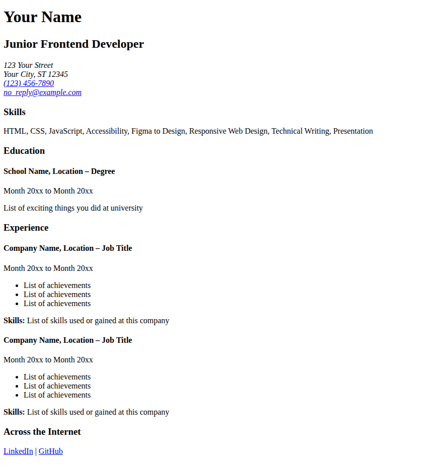
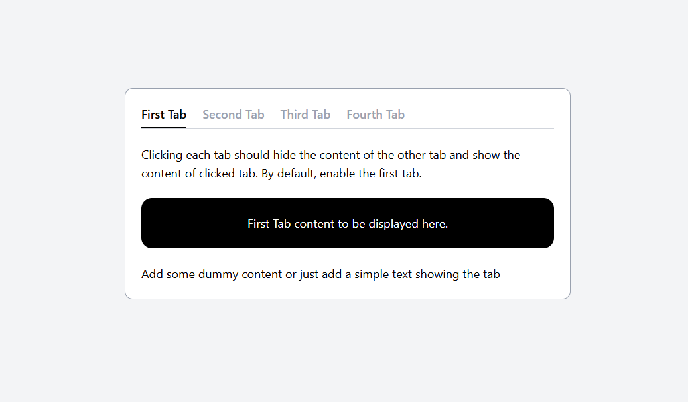
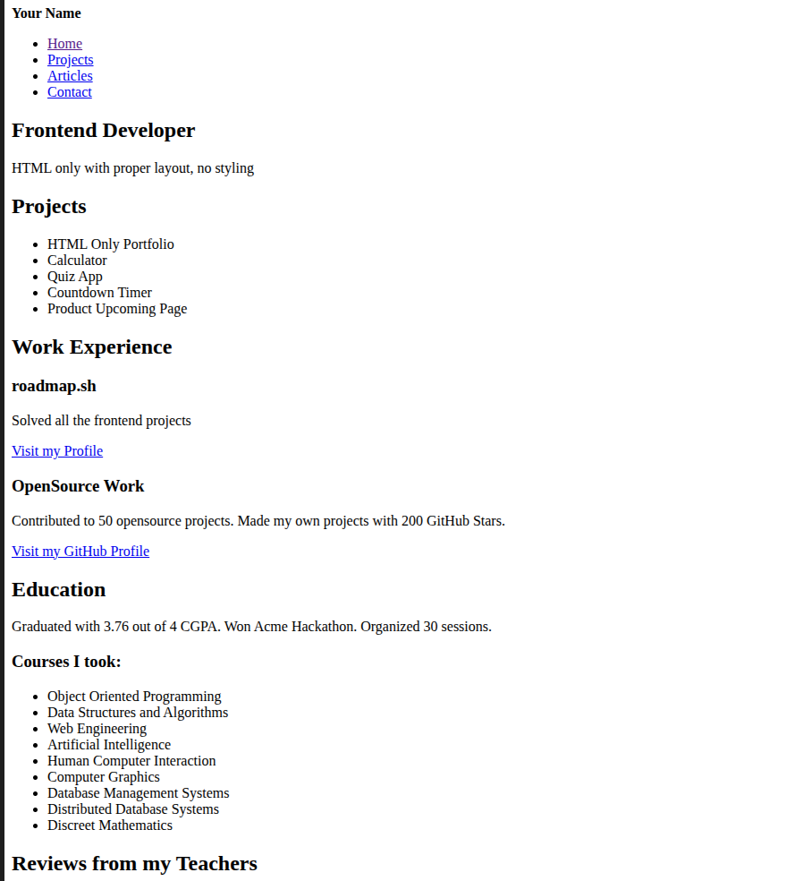

# Front-end Projects from Roadmap.sh

This repository contains front-end projects built following the [roadmap.sh](https://roadmap.sh/) front-end developer path.

## Projects List

[Single Page Cv](https://roadmap.sh/projects/single-page-cv),
[Tabs](https://roadmap.sh/projects/simple-tabs)
[Basic Html Website](https://roadmap.sh/projects/simple-tabs)

Click any of the images below to view the readme and live demo of the project.

  
  
  

